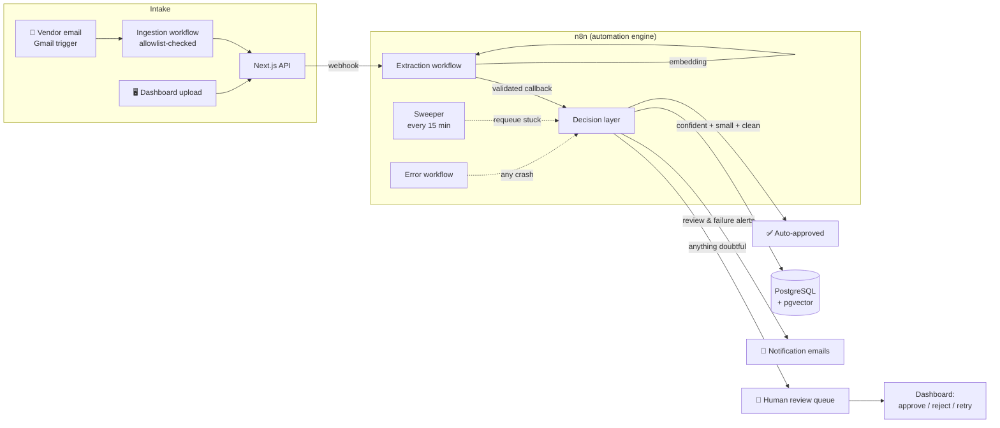

# Clara — an AI Accounts-Payable Employee

Clara is an AI automation system that does the job of a junior AP clerk:
she watches an inbox, reads invoice PDFs with LLM vision, validates them
against business rules and vendor master data, catches duplicate and
near-duplicate billing, **auto-approves only what she's confident about**,
and escalates everything else to a human review queue — with a complete,
append-only audit trail of every decision, human or AI.

Built as a production-grade portfolio project: not a chatbot, an **AI
employee with a paper trail**.



## What it demonstrates

| Feature | Production concept |
| --- | --- |
| Gemini vision reads PDFs into schema-enforced JSON, re-validated with Zod | Structured outputs — transport *and* business validation |
| Prompt engineered for "null over guess", ambiguity escape hatches, calibrated confidence | Hallucination mitigation |
| Auto-approval only when confidence ≥ threshold, amount ≤ limit, vendor known, zero flags | Confidence-based routing (the heart of HITL) |
| DB unique constraint **plus** pgvector cosine similarity on canonical-text embeddings | Duplicate defense in depth (exact + near-duplicate) |
| Invoice status is a strict state machine; every transition writes an audit row in the same transaction | Governable AI, compliance-ready audit trail |
| Humans approve/reject/retry through the *same* audited state machine as the AI | Human-in-the-loop, symmetrical by design |
| App fires webhook, returns instantly; results arrive on authenticated callbacks | Async orchestration — users never wait on an LLM |
| Node-level retries, human retry path, global error workflow, stuck-job sweeper | Reliability engineering (designed from real Gemini 503 outages) |
| Every run recorded with n8n execution id; dashboard health panel | Observability |
| Session auth (jose JWT, httpOnly) for humans, shared-secret header for services, sender allowlist for the inbox | Layered security |

## Stack

**Next.js 16** (App Router, TypeScript) · **n8n** (self-hosted, workflows
version-controlled as JSON) · **PostgreSQL 16 + pgvector** · **Prisma 7** ·
**Google Gemini** (vision extraction + embeddings — free tier) · **Gmail
API** (ingestion + notifications) · **Docker Compose** · Tailwind · Zod ·
Vitest

Total build cost: **$0** (self-hosted n8n, Gemini free tier).

## Quick start

```bash
git clone https://github.com/gabrielpaor/clara-ai && cd clara-ai
cp .env.example .env                  # fill in values
docker compose up -d                  # n8n + Postgres (pgvector)

cd web
cp .env.example .env                  # fill in values
npm install
npx prisma migrate dev && npx prisma db seed
npm run dev                           # dashboard on :3000

# import + activate all n8n workflows (from repo root)
./scripts/import-workflows.sh         # or scripts\import-workflows.ps1
```

Then in n8n (localhost:5678): add your Gemini API key to the
**Google Gemini API Key** credential, connect **Clara Gmail** (OAuth —
see [docs/deployment.md](docs/deployment.md#gmail-oauth)), and upload a
PDF from [samples/](samples/) on the dashboard (login is printed by the
seed script — change it immediately for any non-local use).

## Repository tour

```
├─ docker-compose.yml          # n8n + Postgres/pgvector infrastructure
├─ n8n/
│  ├─ workflows/               # 5 workflows as version-controlled JSON
│  └─ prompts/                 # extraction prompt + design rationale
├─ web/
│  ├─ prisma/schema.prisma     # Invoice state machine, audit log, vendors
│  └─ src/
│     ├─ app/api/              # public, session-guarded + internal endpoints
│     ├─ app/(dashboard)/      # review queue, detail w/ audit timeline, health
│     └─ lib/                  # state machine, rules engine, dispatch, auth
├─ docs/
│  ├─ architecture.md          # full design: diagrams, decisions, lifecycle
│  ├─ deployment.md            # production topology + security checklist
│  ├─ demo-script.md           # 5-minute walkthrough
│  └─ learning-notes.md        # concepts + war stories from the build
└─ samples/                    # generated test invoices (3 vendors, 2 currencies)
```

## Documentation

- **[Architecture](docs/architecture.md)** — system design, key decisions
  with alternatives considered, invoice lifecycle state machine
- **[Deployment](docs/deployment.md)** — production topology, free-tier
  reality check, security hardening checklist
- **[Demo script](docs/demo-script.md)** — the 5-minute tour
- **[Learning notes](docs/learning-notes.md)** — every concept in the
  build, plus the war stories (503 outages, binary-data stubs, Prisma
  shadow-database traps) and how they were debugged

## Honest limitations & next steps

- File storage is local disk behind a narrow interface
  ([storage.ts](web/src/lib/storage.ts)) — swapping in S3/R2 is the one
  code change needed for serverless deployment (see deployment guide).
- Vendor matching is exact-name; fuzzy matching (pg_trgm or embeddings)
  is the natural next iteration.
- Line-item extraction, multi-page invoices, PO matching, and payment
  scheduling (`APPROVED → SCHEDULED → PAID` is modeled but unautomated)
  are deliberate scope cuts — the lifecycle supports them.
